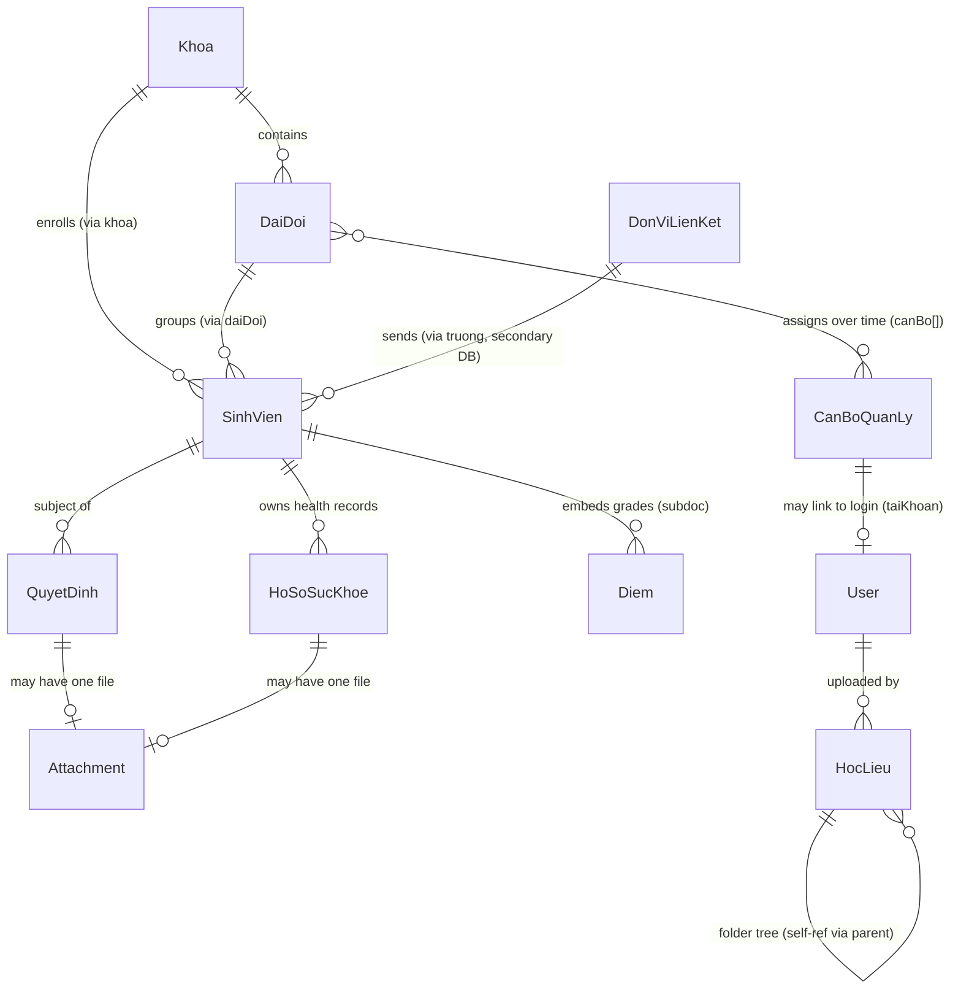

# Database Schema Reference

**ODM**: Mongoose 9

**Last updated**: 2026-05-16

This catalog covers every Mongoose model the backend defines. Each entry links to a field-by-field reference; the cross-cutting story (ERD, indexes, two-connection setup) lives in [`/docs/architecture/database.md`](../../architecture/database.md).

## Primary cluster (13 models)

Operational data the app reads and writes. Connected via `MONGO_URI` through `mongoose.connect()` in [`backend/src/config/db.js`](../../../backend/src/config/db.js).

### Core people and records

| Schema | Collection | Purpose | Detail |
|---|---|---|---|
| `User` | `users` | Authentication and authorization accounts | [User.md](./User.md) |
| `SinhVien` | `sinh_vien` | Students — also embeds `diem[]` grades | [SinhVien.md](./SinhVien.md) |
| `CanBoQuanLy` | `can_bo_quan_ly` | Management staff / instructors | [CanBoQuanLy.md](./CanBoQuanLy.md) |
| `QuyetDinh` | `quyet_dinh` | Administrative decisions affecting a student | [QuyetDinh.md](./QuyetDinh.md) |
| `HoSoSucKhoe` | `ho_so_suc_khoe` | Health / hospitalization records | [HoSoSucKhoe.md](./HoSoSucKhoe.md) |

### Organizational structure

| Schema | Collection | Purpose | Detail |
|---|---|---|---|
| `Khoa` | `khoa` | Faculties / departments | [Khoa.md](./Khoa.md) |
| `DaiDoi` | `dai_doi` | Battalions; aligned-arrays history of staff assignments | [DaiDoi.md](./DaiDoi.md) |

### Files

| Schema | Collection | Purpose | Detail |
|---|---|---|---|
| `HocLieu` | `hoc_lieu` | Learning-materials repository nodes (folders + files) | [HocLieu.md](./HocLieu.md) |
| `Attachment` | `attachments` | One-attachment-per-record file refs (polymorphic to QuyetDinh / HoSoSucKhoe) | [Attachment.md](./Attachment.md) |

### Admin / config

| Schema | Collection | Purpose | Detail |
|---|---|---|---|
| `SystemSetting` | `systemsettings` | Key–value runtime config (training-schedule link, etc.) | [SystemSetting.md](./SystemSetting.md) |
| `KhaoSatChatLuongNam` | `khao_sat_chat_luong_nam` | Per-year quality-survey link configuration | [KhaoSatChatLuongNam.md](./KhaoSatChatLuongNam.md) |
| `GiangVienKhaoSat` | `giangVien` *(yes, camelCase)* | Per-year list of instructors with feedback URLs | [GiangVienKhaoSat.md](./GiangVienKhaoSat.md) |
| `TrucQuanSu` | `truc_quan_su` | Daily military-duty roster | [trucQuanSu.md](./trucQuanSu.md) |

## Secondary cluster (2 models)

Reference data the app reads from a separate Mongo cluster. Connected via `MONGO_URI2` through `mongoose.createConnection()` in [`backend/src/db/secondaryConnection.js`](../../../backend/src/db/secondaryConnection.js).

| Schema | Collection | Purpose | Detail |
|---|---|---|---|
| `DonViLienKet` | `schools` | Partner organizations (sending schools). Fields aliased: `ten ↔ ten_truong`, `heDaoTao ↔ he_dao_tao` | [DonViLienKet.md](./DonViLienKet.md) |
| `CertificateLookup` | `students` | Historical certificate index (snake-case fields, owned by the [Certificate Management](https://github.com/Kubogi/certificate-management-docs) project) | [CertificateLookup.md](./CertificateLookup.md) |

> ⚠ Don't confuse the secondary `students` collection (read-only, snake_case) with the primary `sinh_vien` collection (mutable, camelCase). They mirror only loosely.

## Entity relationships (primary cluster)

`Diem` is **embedded** inside `SinhVien.diem[]` — there is no separate collection. The `/api/diem` REST endpoints are a logical view.

## Common patterns

### Field naming

- Vietnamese **camelCase** in the schema (`hoTen`, `daiDoi`).
- Vietnamese **snake_case** for the on-disk `collection:` name (`sinh_vien`, `dai_doi`).
- The **secondary** cluster's fields are snake_case Vietnamese on disk; Mongoose `alias` maps them to camelCase in code.

### Indexes

Every model in the catalog above declares its indexes inline (`schema.index(...)`). Don't rely on Mongoose's auto-creation in production — production deploys should run `Model.syncIndexes()` after schema changes to drop obsolete indexes. The full index catalog is in [`/docs/architecture/database.md`](../../architecture/database.md#4-indexes).

### Timestamps

All schemas except `DonViLienKet` and `CertificateLookup` (secondary, read-only) enable `timestamps: true` so `createdAt` / `updatedAt` are populated automatically.

### Lifecycle hooks

Only two hooks exist (see [`database.md`](../../architecture/database.md#7-lifecycle-hooks-worth-knowing)):

- `SinhVien.diem[].pre('validate')` — computes `tbMon` with integer arithmetic.
- `DaiDoi.pre('validate')` — enforces equal lengths across `canBo`, `soQD`, `ngayQD`, `hieuLuc` arrays.

## See also

- [`/docs/architecture/database.md`](../../architecture/database.md) — cross-cutting view: connections, ERD, indexes, gotchas
- [`/docs/api/README.md`](../../api/README.md) — REST endpoint catalog
- [`/docs/architecture/auth.md`](../../architecture/auth.md) — how `User.allowedUnits` and `User.teacherScope` shape queries
- [`backend/src/models/`](../../../backend/src/models/) — source files (authoritative)
