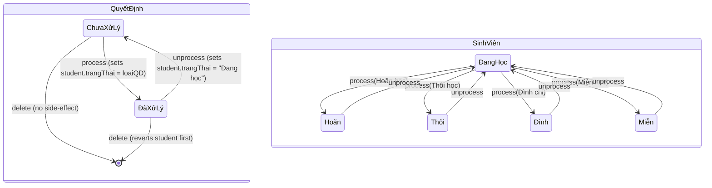

# Decision Processing

**Triggered from**: [Quản lý các QĐ/CV](../frontend/pages/quan-ly-sinh-vien/quan-ly-cac-quyet-dinh.md) page.

**Touches**: `POST/PATCH/DELETE /api/quyet-dinh/:id`, `PATCH /api/sinh-vien/:id`, `QuyetDinh` and `SinhVien` models.

**Who can do this**: `admin`.

## Goal

A "quyết định" (administrative decision — Hoãn học, Thôi học, Đình chỉ, Miễn học) records an action taken on a student. Each QĐ has a status: **Chưa xử lý** (not yet processed) or **Đã xử lý** (processed). Processing a QĐ and updating the student's `trangThai` are **two separate API calls made by the frontend**:
1. `PATCH /api/quyet-dinh/:id` — updates the QĐ record only; the backend does not touch `SinhVien`.
2. `PATCH /api/sinh-vien/:id` — a separate call the frontend makes immediately after, to update the student status.

There is **no backend enforcement** of this coupling. An API client that only patches the QĐ will not trigger any student-status side effect.

The system enforces that `trangThai` changes never happen silently — every transition requires an admin to confirm via a modal.

## State diagram

## Happy path — creating an unprocessed QĐ

1. Admin opens "Quản lý các QĐ/CV", clicks **Thêm QĐ**.
2. Fills the form with student, soQD, ngayKiQD, loaiQD, lyDo, attachment. `trangThai` defaults to `Chưa xử lý`.
3. **Submit.** The frontend calls `POST /api/quyet-dinh` with the body. The new record lands with `trangThai: "Chưa xử lý"`. **No student-status change.**
4. Modal closes, table refreshes.

## Happy path — processing a QĐ (Chưa xử lý → Đã xử lý)

1. Admin opens the row, clicks **Sửa**, switches `trangThai` to `Đã xử lý`, saves.
2. Frontend detects the status change. Per the decision-processing memory, it does **not** ship the status flip in the initial PATCH. Instead:
   a. It first sends the PATCH with all other fields, **keeping** `trangThai: "Chưa xử lý"`.
   b. On success, it shows the **process-confirmation modal**: "This will set student X's status to <loaiQD>. Continue?"
   c. If the admin confirms, it sends a second request flipping `trangThai` to `Đã xử lý`, then sends a `PATCH /api/sinh-vien/<id>` setting the student's `trangThai` to match `loaiQD`.
3. Table refreshes; the student's status in the database is now (for example) `Hoãn học`.

## Happy path — unprocessing a QĐ (Đã xử lý → Chưa xử lý)

1. Admin edits the row, switches `trangThai` back to `Chưa xử lý`.
2. Same two-step pattern: the PATCH carries everything *except* the status flip.
3. **Unprocess-confirmation modal**: "This will revert student X to Đang học. Continue?"
4. On confirm: a second PATCH flips `trangThai`, then `PATCH /api/sinh-vien/<id>` sets `trangThai: "Đang học"`.

## Happy path — deleting a QĐ

Two cases:

### Unprocessed (`Chưa xử lý`)

1. Admin clicks **Xoá** on the row.
2. Simple confirmation modal: "Delete this decision?"
3. `DELETE /api/quyet-dinh/:id`. Backend returns `204`.
4. No student-status change.

### Processed (`Đã xử lý`)

1. Admin clicks **Xoá** on the row.
2. **Warning modal:** "This decision is currently in effect. Deleting it will revert student X to Đang học. Continue?"
3. On confirm:
   a. Frontend sends `PATCH /api/sinh-vien/:studentId` with `trangThai: "Đang học"`.
   b. Then `DELETE /api/quyet-dinh/:id`.
4. Table refreshes.

If step (a) fails, do **not** proceed to step (b) — otherwise the decision is gone but the student is still in the deferred/withdrawn state with no audit trail.

## Side-effects summary

| Operation | Touches |
|---|---|
| Create QĐ (chưa xử lý) | `quyet_dinh` insert |
| Edit QĐ without status change | `quyet_dinh` update |
| Edit QĐ with status change (process) | `quyet_dinh` update + `sinh_vien.trangThai` update |
| Edit QĐ with status change (unprocess) | `quyet_dinh` update + `sinh_vien.trangThai = "Đang học"` |
| Delete unprocessed QĐ | `quyet_dinh` delete |
| Delete processed QĐ | `sinh_vien.trangThai = "Đang học"` first, then `quyet_dinh` delete |

## Failure modes

| Scenario | Result | Recovery |
|---|---|---|
| The two PATCHes succeed but the third (student update) fails | QĐ shows `Đã xử lý`, student still in old `trangThai`. Inconsistent. | Admin can re-edit the QĐ to re-trigger the modal; or manually fix `sinh_vien.trangThai` in mongosh. |
| Race: two admins process the same QĐ simultaneously | Both win-by-last-write. Student `trangThai` reflects whichever PATCH completed last. | Acceptable; the operational team coordinates QĐ processing. |
| Decision references a deleted student (`sinhVien` ObjectId no longer in `sinh_vien`) | Process/unprocess silently no-ops on the missing student; QĐ status still flips. | Don't delete `SinhVien` documents that have associated `QuyetDinh`. Use student-status `Thôi học` instead of physical deletion. |

## Manual test recipe

Cover all six transitions:

- [ ] Create QĐ for a student in `Đang học`. Confirm student remains `Đang học`.
- [ ] Process QĐ to `Đã xử lý` with `loaiQD: "Hoãn học"`. Confirm modal appears; on confirm, student becomes `Hoãn học`.
- [ ] Unprocess QĐ back to `Chưa xử lý`. Confirm modal appears; on confirm, student becomes `Đang học`.
- [ ] Process again. Confirm student becomes `Hoãn học`.
- [ ] Delete the *processed* QĐ. Confirm the warning modal appears; on confirm, student becomes `Đang học` AND the QĐ row disappears.
- [ ] Create a fresh QĐ, leave it unprocessed, delete it. Confirm only the simple confirmation modal appears (no student-status warning); QĐ row disappears; student remains `Đang học`.
- [ ] Try processing a QĐ but cancel the modal. Confirm `trangThai` on the QĐ remains `Chưa xử lý` and the student's status is unchanged.

## Related

- [QuyetDinh schema](../backend/schemas/QuyetDinh.md)
- [SinhVien schema](../backend/schemas/SinhVien.md) — `trangThai` enum
- [`/api/quyet-dinh`](../api/README.md#decisions-apiquyet-dinh) — endpoint reference
- [`docs/glossary.md`](../glossary.md#decision-types-loại-qđ--values-of-quyetdinhloaiqd) — decision-type table
