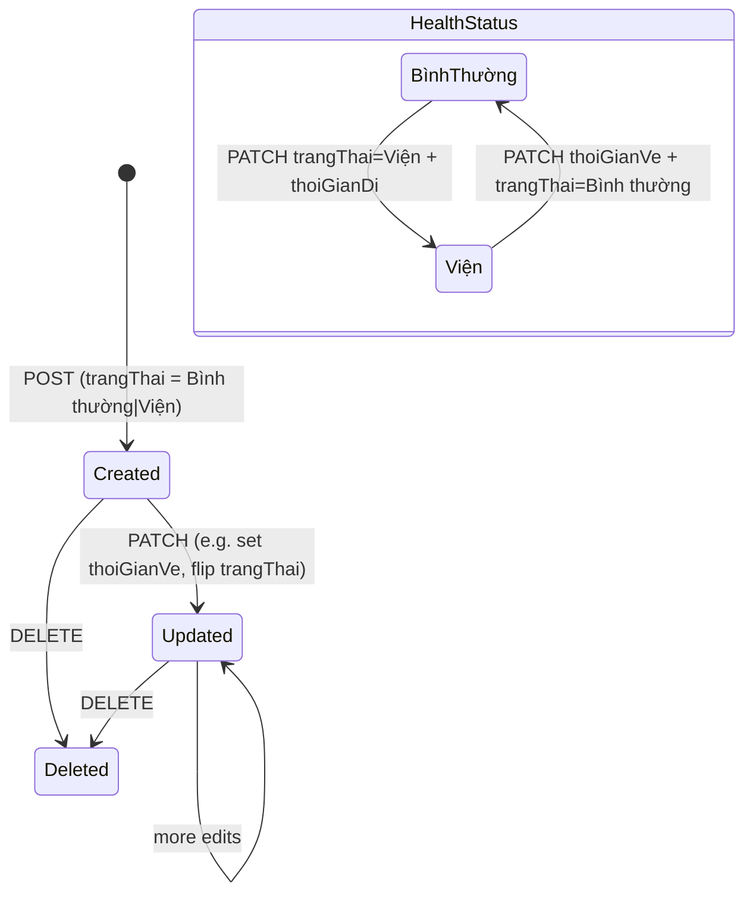

# Health Record Tracking

**Triggered from**: [Hồ sơ sức khỏe](../frontend/pages/quan-ly-sinh-vien/ho-so-suc-khoe.md), [Sổ tay giảng viên — Cập nhật hồ sơ sức khỏe](../frontend/pages/quan-ly-giang-day/so-tay-giang-vien.md).

**Touches**: `POST/PATCH/DELETE /api/ho-so-suc-khoe`, `GET /api/ho-so-suc-khoe/stats`, `POST/DELETE /api/attachments`, `HoSoSucKhoe` and `Attachment` models.

**Who can do this**: `admin` only for create, update, and delete (`POST`, `PATCH`, `DELETE` all use `authorize(['admin'])`). `staff`, `teacher`, and `viewer` are **read-only**.

## Goal

Capture each health event (illness, hospitalization, discharge) for a student. Aggregate counts per unit for reporting.

## State diagram

## Happy path — new hospital admission

1. Staff opens **Hồ sơ sức khỏe**, clicks **Thêm hồ sơ**.
2. Picks the student (`SearchableSelect` over filtered SinhVien).
3. Fills the record: `trangThai: "Viện"`, `thoiGianDi.{gio, ngay}`, `benhVien`, `lyDo`, optionally `chuanDoanBenhVien`, `nguoiDiKem`, `thuocDTCC`, `sinhVienDiCung`, `khung`.
4. Optionally uploads an admission scan via the embedded `AttachmentField`. One attachment per record, owner type `HoSoSucKhoe`.
5. **Save** → `POST /api/ho-so-suc-khoe`. Server inserts the row, returns `201 { data }`.
6. If an attachment was selected, the controller follows up with a multipart upload to `POST /api/attachments` referencing the new record.

## Happy path — discharge

1. Open the existing "Viện" record. Click **Sửa**.
2. Fill `thoiGianVe.{gio, ngay}`. Optionally update `chuanDoanBenhVien` and `thuocDTCC`.
3. Flip `trangThai` to `"Bình thường"`.
4. **Save** → `PATCH /api/ho-so-suc-khoe/:id`.

## Happy path — stats

`GET /api/ho-so-suc-khoe/stats` returns `{ data: [{ trangThai, soCa }] }`. The "Báo cáo" tab on the page renders this; the [Sổ tay giảng viên](../frontend/pages/quan-ly-giang-day/so-tay-giang-vien.md) page doesn't expose it directly.

## Side-effects

- **No student-status side-effect.** A health record never changes `SinhVien.trangThai`; that's `QuyetDinh`'s job.
- **Attachment cascade is NOT implemented.** Deleting a health record does **not** cascade-delete its attachment. The `remove()` function in `hoSoSucKhoe.service.js` calls `findOneAndDelete()` with no cascade — the attachment row and on-disk file are orphaned.

## Failure modes

| Scenario | Result |
|---|---|
| Missing required field on POST | `400 VALIDATION_ERROR` from `hoSoSucKhoeCreateSchema` |
| PATCH a non-existent record | `404 NOT_FOUND` |
| Upload a second attachment to the same record | `409 ATTACHMENT_EXISTS` |
| Non-admin attempts to create, update, or delete | `403 FORBIDDEN` (write routes are `admin`-only) |
| Student referenced by `sinhVien` is deleted | The health record's `populate('sinhVien')` returns null; UI shows "<unknown student>" but the row is otherwise intact. |

## Manual test recipe

- [ ] Create a "Viện" record with an attachment. Verify the file is downloadable via the attachment endpoint.
- [ ] Edit to mark discharged: set `thoiGianVe`, `trangThai = Bình thường`. Verify Báo cáo aggregate shrinks the "Viện" count and grows "Bình thường".
- [ ] Delete the record. Note: the attachment row and on-disk file are **orphaned** (no cascade implemented) — verify in mongosh and clean up manually if needed.
- [ ] As a `staff` or `teacher` user, attempt to create or edit a health record. Expect `403 FORBIDDEN` (write routes are `admin`-only).
