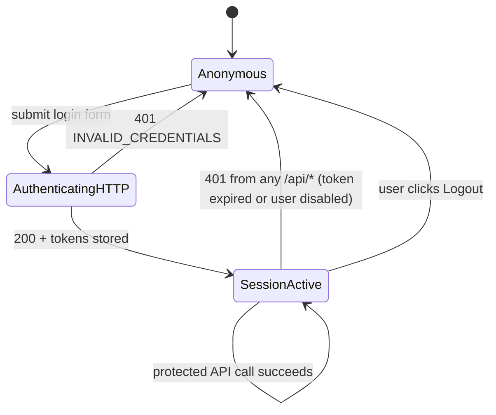

# Login & Session Lifecycle

**Triggered from**: [`LoginPage.tsx`](../../frontend/src/LoginPage.tsx) and every subsequent protected API request.

**Touches**: `POST /api/auth/login`, `authGuard` middleware, `User` model, `localStorage` keys `accessToken` / `refreshToken` / `authUser`.

**Who can do this**: anyone (login is public).

## Goal

A user lands on `/login`, enters credentials, and ends up at the dashboard with a valid JWT in the browser. Subsequent API calls succeed silently until the access token expires; after that, the client wipes its tokens and bounces back to login.

## Happy path

1. **User submits credentials.** The login form (`LoginPage.tsx`) calls `authProvider.login({ username, password })`.
2. **Frontend POSTs to `/api/auth/login`.** `authProvider.ts` does this with a raw `fetch`, **not** through `api/client.ts`, so the 401-auto-logout interceptor doesn't fire on a failed login.
3. **Backend validates the payload.** `validate(loginSchema)` enforces `{ username: string, password: string }`.
4. **`auth.service.login` runs.**
   - `User.findOne({ username: <lowercased> })`.
   - If the user is missing or `status === 'disabled'`: throw `401 INVALID_CREDENTIALS`.
   - `bcrypt.compare(plain, passwordHash)`. Mismatch → `401 INVALID_CREDENTIALS`.
   - Sets `user.lastLogin = new Date()` and saves.
   - `signAccessToken(user)` — HS256-signed with `JWT_SECRET`, 1 h expiry, payload `{ sub, role, allowedUnits, teacherScope? }`.
   - `signRefreshToken(user)` — HS256 with `JWT_REFRESH_SECRET`, 7 d expiry, payload `{ sub }`.
5. **Response:** `200 { data: { accessToken, refreshToken, user: { id, username, role, allowedUnits, teacherScope? } } }`.
6. **Frontend stores tokens.** `authProvider.login` writes `accessToken`, `refreshToken`, and the cached user to `localStorage`.
7. **react-admin proceeds.** `<Admin>` calls `checkAuth()` (which sees `accessToken` and resolves), `getPermissions()` (returns `user.role`), then renders the dashboard with role-filtered resources.

## Subsequent request flow

For every API call the SPA makes through `api/client.ts request()`:

1. The function reads `accessToken` from `localStorage` and attaches `Authorization: Bearer <accessToken>`.
2. On the backend, `authGuard` verifies the JWT (`jwt.verify` with `JWT_SECRET`), loads the User by `sub`, rejects if `user.status === 'disabled'`. Attaches `req.user`.
3. `authorize(['...'])` checks `req.user.role` against the route's allow-list, rejecting with `403 FORBIDDEN` on mismatch.
4. Service layer applies `allowedUnits` / `teacherScope` scoping using `utils/permissions.js`.
5. Response is returned to `api/client.ts`, which unwraps the `{ data, meta }` envelope.

## State diagram

## Side-effects

- **`User.lastLogin` is bumped** on every successful login. Useful for inactive-account audits.
- **No server-side session state** — there is no blacklist, no token store. A leaked access token works until its `exp` claim passes (max 1 h) regardless of any "logout" action.
- **JWT payload carries `teacherScope` for teachers only.** Admins/staff/viewers get the payload without that key; this saves token size and is also what makes the frontend's `useTeacherScope()` hook a no-op for non-teachers.

## Failure modes

| What goes wrong | Where it shows up | Why |
|---|---|---|
| Bad username/password | `401 INVALID_CREDENTIALS`, Vietnamese error in login form | `auth.service.login` |
| Disabled user (status=`disabled`) tries to log in | Same `INVALID_CREDENTIALS` — by design, doesn't leak account existence | `auth.service.login` |
| User got disabled mid-session | Next request hits `authGuard`, gets `401 UNAUTHORIZED`. Client wipes tokens, redirects to login. | `auth.middleware.js#authGuard` |
| Access token expired (default 1 h) | Next request `401`. Client wipes tokens, redirects to login. **The refresh endpoint is not used by the live frontend.** | `jwt.verify` throws `TokenExpiredError` |
| `JWT_SECRET` was rotated since the token was issued | Every existing token instantly invalid → mass forced-logout. | `jwt.verify` throws `JsonWebTokenError` |
| `MONGO_URI` is reachable but the `users` collection is empty (fresh deploy without seed) | Every login is `INVALID_CREDENTIALS` until `npm run create:admin` is run. | `auth.service.login` |
| Frontend stores tokens in `localStorage` | An XSS exfiltrates them. This is the threat model — keep the SPA free of `dangerouslySetInnerHTML` and untrusted scripts. | Architectural choice; see [`docs/architecture/auth.md`](../architecture/auth.md) |

## Manual test recipe

Cover the happy path and the most common failure modes:

- [ ] Start backend + frontend per [`getting-started.md`](../guides/getting-started.md).
- [ ] Seed admin: `cd backend && npm run create:admin -- --username admin --password "Strong!"`.
- [ ] Open `http://localhost:5173/`, log in with admin/Strong!. Expect to land on the dashboard.
- [ ] Open browser devtools → Application → Local Storage. Confirm `accessToken`, `refreshToken`, `authUser` are present.
- [ ] Wait for `accessToken.exp` (≈ 1 h) or shorten `JWT_EXPIRES_IN=10s` in `.env`, restart backend, log in again. After 10 s, click any menu item — expect a redirect to `/login` and the three localStorage keys gone.
- [ ] In `mongosh`, set `db.users.updateOne({ username: 'admin' }, { $set: { status: 'disabled' } })`. From the SPA, click any menu item — expect immediate redirect to `/login`.
- [ ] Try logging in with the disabled admin — expect `Tên đăng nhập hoặc mật khẩu không đúng` (the generic 401), not "account disabled" (we don't leak that).
- [ ] Re-enable the user (`status: 'active'`), confirm login works again.
- [ ] Decode the access token at `jwt.io`. Confirm `role`, `allowedUnits` are present. For a `teacher` user, confirm `teacherScope` is also present; for non-teachers, confirm it is absent.
