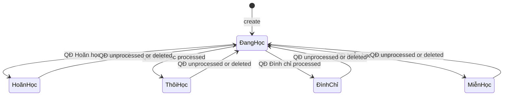

# Student Lifecycle

**Triggered from**: many pages. The student record is the spine of the system.

**Touches**: `SinhVien` (mutable, `trangThai` evolves), `Khoa`, `DaiDoi`, `DonViLienKet`, `QuyetDinh`, `HoSoSucKhoe`, embedded `diem[]`.

**Who can do this**: `admin` for create/edit/delete; `staff`/`viewer` read inside their `allowedUnits`; `teacher` reads inside their `teacherScope`.

## Goal

Track a student from initial enrollment in a cohort through their final state (graduated / withdrawn / suspended / exempted). The student's `trangThai` is the canonical lifecycle state; everything else (grades, decisions, health records) attaches to it.

## State diagram (student.trangThai)

Notes:
- The five values come from the enum on `SinhVien.trangThai`.
- The only mechanism that ships in the codebase to move a student out of `Đang học` is a processed `QuyetDinh` (see [decision-processing.md](decision-processing.md)).
- There's no "graduated" terminal state — that's modeled at the cohort (`Khoa`) level by `ngayKetThuc`, not on the student.

## Phase 1 — enrollment

### Manual creation

1. Admin opens [Cơ sở dữ liệu sinh viên](../frontend/pages/quan-ly-sinh-vien/co-so-du-lieu-sinh-vien.md), clicks **Thêm sinh viên**.
2. Fills the modal: `maSV` (must be unique inside `(maSV, hoTen, ngaySinh)`), name, DOB, birthplace, gender, major, phone, lop, `khoa`, `daiDoi`, `truong`, `ngayNhapHoc`. `trangThai` is pre-selected as `'Đang học'` in the UI form, but this is **UI-level behaviour only** — the `SinhVien` schema defines `trangThai` as a String enum field with **no `default:` value**. If the field is omitted, Mongoose stores `undefined`.
3. `POST /api/sinh-vien` validates with `sinhVienCreateSchema`. The Joi schema also enforces that `daiDoi.khoa` matches the body's `khoa` (the validator was hardened by [commit 7840d44](../../README.md) to catch cross-khoa daiDoi assignments).
4. Backend writes the document. The `{ maSV, hoTen, ngaySinh }` sparse unique index rejects exact duplicates with `409 DUPLICATE_SINH_VIEN`.

### Bulk import (Excel)

See [excel-import-students.md](excel-import-students.md). The summary: multi-sheet `.xlsx`, sheet name = `daiDoi`, row 5 header, row 6+ data. Missing `daiDoi`s auto-create.

## Phase 2 — assignment to units

Even after creation, students can be reassigned:

- **Re-assign `daiDoi` within the same `khoa`** — open the row, edit `daiDoi`. Backend validates that the new daiDoi belongs to the same `khoa`.
- **Bulk re-assignment** — use [Biên chế đại đội tự động](../frontend/pages/quan-ly-sinh-vien/bien-che-dai-doi-tu-dong.md), which has two tabs:
  - *Biên chế đại đội* — rule-driven distribution of unassigned students into daiDois.
  - *Chuyển đại đội* — bulk move between daiDois.
- **Change `khoa`** — supported but rare; usually only when a student is mistakenly enrolled in the wrong cohort.

## Phase 3 — academic life

Three independent records accumulate on each student:

| Record | Where | When |
|---|---|---|
| Grades (`diem[]`) | Embedded on `SinhVien` | Per-subject scoring throughout the cohort. `tbMon` is auto-computed by the `pre('validate')` hook. See [grade-entry-and-summary.md](grade-entry-and-summary.md). |
| Decisions (`QuyetDinh`) | Separate `quyet_dinh` collection, references `sinhVien` | When an administrative action is taken. See [decision-processing.md](decision-processing.md). |
| Health records (`HoSoSucKhoe`) | Separate `ho_so_suc_khoe` collection, references `sinhVien` | Each hospitalization or health event. |

These records don't drive `trangThai` directly — only a *processed* `QuyetDinh` does.

## Phase 4 — terminal states

| State | Meaning | Reached by |
|---|---|---|
| `Hoãn học` | Studies deferred | Processed QĐ with `loaiQD: "Hoãn học"` |
| `Thôi học` | Withdrawn | Processed QĐ with `loaiQD: "Thôi học"` |
| `Đình chỉ` | Suspended | Processed QĐ with `loaiQD: "Đình chỉ"` |
| `Miễn học` | Exempted | Processed QĐ with `loaiQD: "Miễn học"` |
| `Không tham gia học` | Did not participate in studies | Set at import time via column N of the Excel import; no in-app transition path. |

A student in any non-`Đang học` state still has all their grades, decisions, and health records intact. The `trangThai` change is purely a status flag; it does not cascade-delete anything.

To bring a student back to `Đang học`, unprocess or delete the processed QĐ.

## Phase 5 — deletion

Physical deletion (`DELETE /api/sinh-vien/:id`) is admin-only and dangerous:

- **No cascade**: `sinhVien.service.remove` only deletes the `SinhVien` document. Related `QuyetDinh` and `HoSoSucKhoe` documents that reference this student are **not** deleted — they become orphaned records in their respective collections. Embedded `diem[]` grades are deleted as part of the student document.
- **Preferred alternative**: change `trangThai` to `Thôi học` via a QĐ. This preserves the full history.

Treat physical deletion as an emergency tool for mistakes (wrong student created), not for normal lifecycle progression.

## Per-unit visibility throughout the lifecycle

Every read in this workflow runs through `applyUnitScope` (for staff) or `applyTeacherScope` (for teacher). See [`auth.md`](../architecture/auth.md). Concretely:

- **A staff user with `allowedUnits.khoa = ['K47']`** sees only students inside `khoa K47` — every page above is automatically filtered.
- **A teacher with `teacherScope: [{ khoa: K47, daiDoi: D1 }]`** sees only students inside that intersection. Adding `{ allKhoa: true, daiDoi: D1 }` would give them every D1 student across cohorts.
- **Admin** sees all students regardless of unit.

## Side-effects summary

| Action | Mongo writes |
|---|---|
| Create student | 1 insert into `sinh_vien` |
| Edit student (without status change) | 1 update on `sinh_vien` |
| Grade entry | 1 update on `sinh_vien` (embedded `diem[]` push or replace), runs `pre('validate')` to recompute `tbMon` |
| QĐ processed | 1 update on `quyet_dinh` + 1 update on `sinh_vien.trangThai` (separate requests; see decision-processing) |
| Health record | 1 insert into `ho_so_suc_khoe`; no change to `sinh_vien` |
| Delete student | 1 delete from `sinh_vien`. Related `QuyetDinh` and `HoSoSucKhoe` records become orphaned (no cascade implemented). |

## Failure modes

| Scenario | Result | Recovery |
|---|---|---|
| Two admins create the same student simultaneously | The second hits the `{ maSV, hoTen, ngaySinh }` unique index, gets `409`. | UI surfaces the duplicate; reload to see the existing record. |
| Bulk import creates a `daiDoi` typo | New `DaiDoi` row exists with the typo'd name; the imported students are attached to it. | Open Khóa học → that daiDoi → merge or delete after correcting names. |
| QĐ processed but the student-status PATCH fails | QĐ shows `Đã xử lý`, student remains `Đang học`. | Re-edit the QĐ to retry the side-effect; or fix `sinh_vien.trangThai` in mongosh. |
| Race between QĐ processing and student edit | Either operation can clobber the other; last write wins. | Coordinate offline; no in-app locking. |

## Manual test recipe

- [ ] Create a student via the UI. Confirm `trangThai = "Đang học"` in mongosh.
- [ ] Re-assign their `daiDoi` within the same khoa. Confirm change persists.
- [ ] Try re-assigning to a `daiDoi` in a *different* khoa via the modal — confirm the validator rejects the write.
- [ ] Add a `diem` for the student via [Nhập điểm](../frontend/pages/quan-ly-diem/nhap-diem.md). Confirm `tbMon` is computed and matches the formula.
- [ ] Create and process a QĐ Hoãn học. Confirm student's `trangThai` flips to `Hoãn học`.
- [ ] Delete the processed QĐ. Confirm warning modal, then confirm student reverts to `Đang học`.
- [ ] Delete the student. Confirm the `sinh_vien` row is gone. Related `QuyetDinh` and `HoSoSucKhoe` records referencing this student will be **orphaned** (no cascade) — verify in mongosh and clean up manually if needed.
