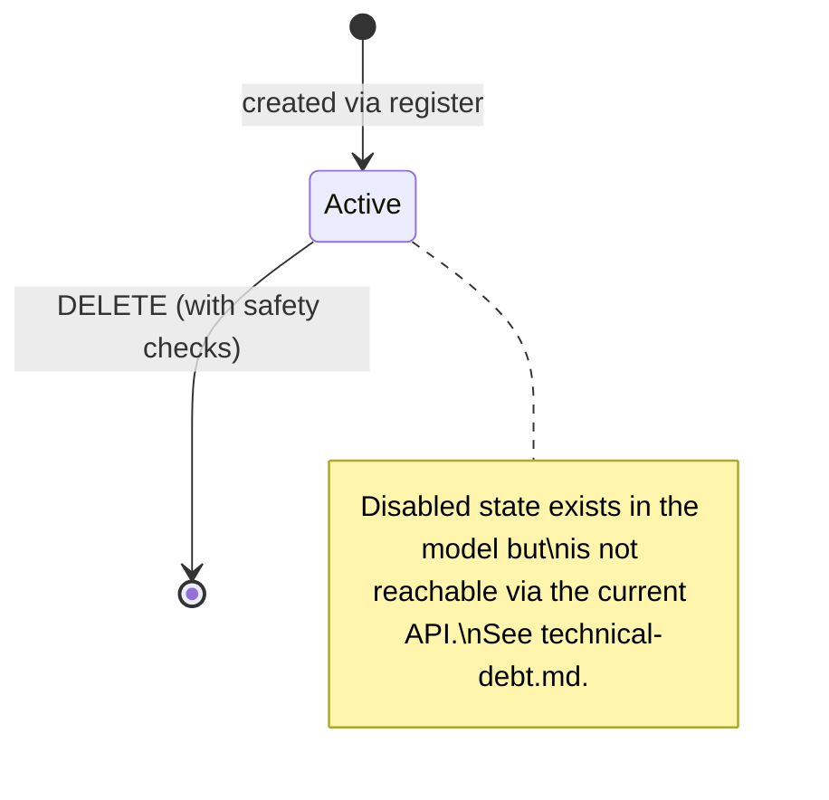

# User Management

**Triggered from**: [Quản lý danh sách người dùng](../frontend/pages/quan-ly-tai-khoan/quan-ly-danh-sach-nguoi-dung.md).

**Touches**: `POST /api/auth/register`, `GET/PATCH/DELETE /api/users/*`, `User` model, `validateTeacherScopeAgainstDB` (cross-DB validation).

**Who can do this**: `admin` only (route gating inside `user.route.js`).

## Goal

Admin creates / edits / disables / deletes user accounts, including configuring per-user access scope: `allowedUnits` for staff, `teacherScope` for teachers.

## Happy path — create a staff user

1. Admin opens the page, clicks **Thêm người dùng**.
2. Modal: `username`, `password`, `role: 'staff'`, plus an `allowedUnits` editor (multi-selects for `khoa`, `daiDoi`, `truong`; `allowAll` toggles per axis).
3. Submit → `POST /api/auth/register`. Backend hashes the password (bcrypt cost 10), inserts a `User` document.
4. Modal closes, table refreshes.

## Happy path — create a teacher with `teacherScope`

1. Same modal, `role: 'teacher'`. The modal expands to show the **TeacherScopeEditor** (separate 820 px dialog).
2. Admin adds one or more `(khoa, daiDoi)` entries. `allKhoa` / `allDaiDoi` toggles per entry act as wildcards on that axis.
3. Submit → frontend forwards `teacherScope` array along with the standard register payload.
4. **Cross-DB validation**: `user.service.validateTeacherScopeAgainstDB` checks every `khoa` ObjectId against the primary `khoa` collection and every `daiDoi` against `dai_doi`. Returns `400 VALIDATION_ERROR` if any reference is dead.
5. On success, user is created with the scope. Their JWT will carry `teacherScope` on next login.

## Disabling a user — not currently supported via the API

The `updateUserSchema` validator (`user.validator.js`) accepts only `role`, `password`, `allowedUnits`, and `teacherScope` — there is **no `status` field**. There is currently **no API endpoint to disable a user**. The `status` field exists in the User model and `authGuard` checks it, but the update endpoint does not expose it. See `technical-debt.md` for the tracking item.

## Happy path — delete a user

`DELETE /api/users/:id`. Backend refuses with `400 CANNOT_DELETE_SELF` if `req.user.id === :id`, and `400 CANNOT_DELETE_LAST_ADMIN` if the user is the only remaining admin.

## State diagram

## Side-effects

- Creating a `teacher` user with `teacherScope` does not auto-link to any `CanBoQuanLy` row. The link, if needed, is managed separately via `CanBoQuanLy.taiKhoan`.
- The `status` field exists in the User model and `authGuard` enforces it (a disabled user's next request is rejected without invalidating the JWT cryptographically), but there is currently no API endpoint to set it. Disabling a user requires a direct DB write.

## Failure modes

| Scenario | Result |
|---|---|
| Duplicate username | `409 USER_EXISTS` |
| Password < 6 chars | `400 VALIDATION_ERROR` from `registerSchema` |
| `teacherScope[i].khoa` not in DB | `400 VALIDATION_ERROR` from cross-DB check |
| Self-delete attempt | `400 CANNOT_DELETE_SELF` |
| Last-admin delete attempt | `400 CANNOT_DELETE_LAST_ADMIN` |

## Manual test recipe

Spot checks:

- [ ] Create a teacher with `teacherScope: [{ khoa: K47, daiDoi: D1 }]`. Log in as that teacher, open Sổ tay giảng viên. Confirm filters auto-fill with K47/D1 and only those students appear.
- [ ] Try to create a teacher with `teacherScope: [{ khoa: <fake>, daiDoi: <fake> }]`. Expect `400 VALIDATION_ERROR`.
- [ ] Attempt `PATCH /api/users/:id` with `{ status: 'disabled' }` — confirm the field is silently ignored (not in `updateUserSchema`). Disabling a user currently requires a direct DB write.
- [ ] Try `DELETE` on yourself → `400`.
